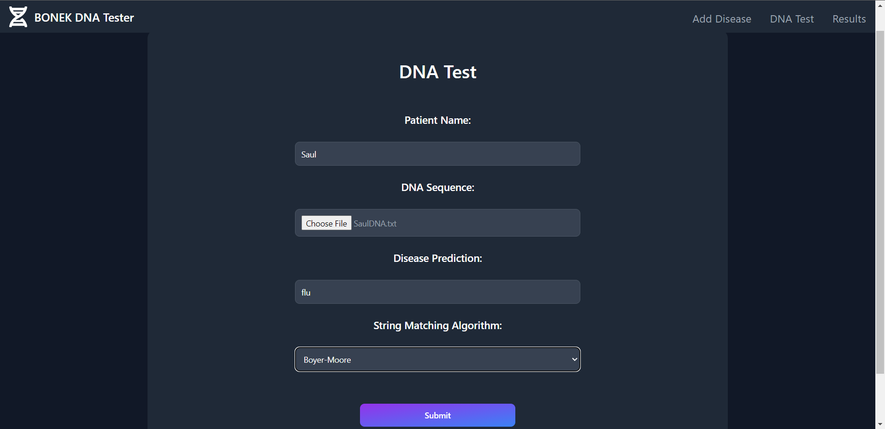
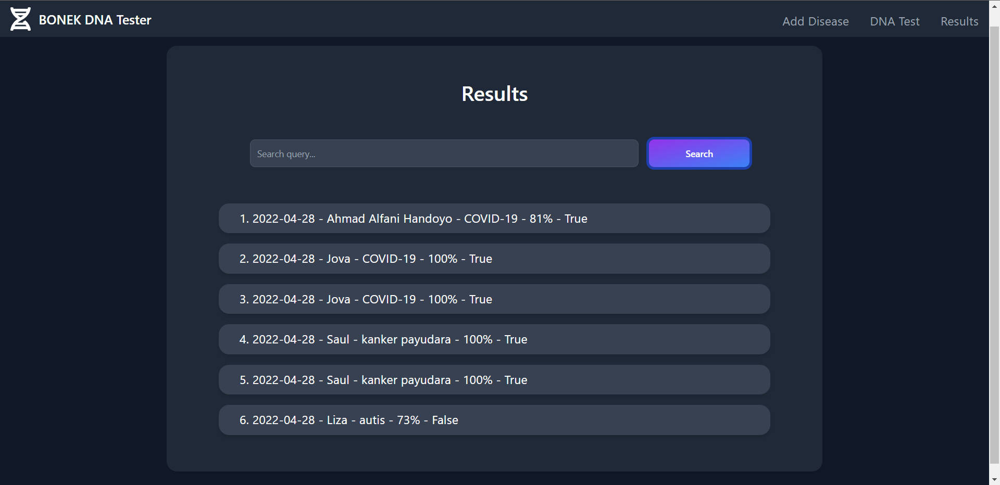
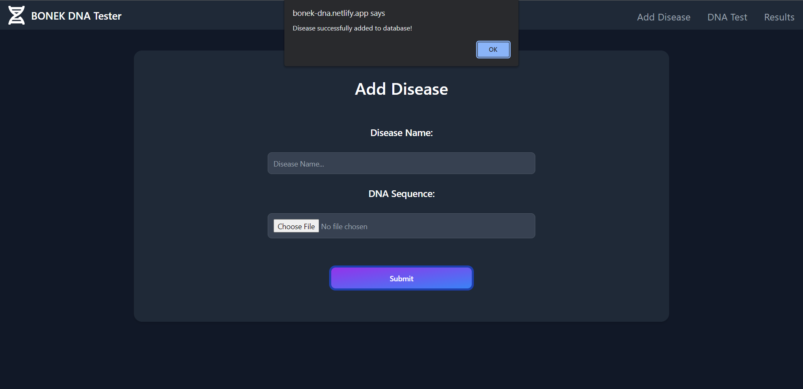

# Tubes 3 - BONEK Returns
> Repository ini merupakan program aplikasi web berupa DNA Sequence Matching yang menerapkan algoritma String Matching KMP, BM, dan Regex untuk menemukan pola DNA suatu penyakit dalam sequence DNA manusia. Video demonstrasi dapat diakses melalui link <a href="https://bonek-dna.netlify.app/">berikut</a>

Repository program ini dibuat untuk memenuhi **Tugas Besar Mata Kuliah IF2211 Strategi Algoritma** yang ke-3 pada Semester II Tahun Akademik 2021/2022. 

## Table of Contents
* [General Info](#general-information)
* [Algorithms Used](#algorithms-used)
* [Technologies Used](#technologies-used)
* [Features](#features)
* [Screenshots](#screenshots)
* [Setup](#setup)
* [Usage](#usage)
* [Project Status](#project-status)
* [Contact](#contact)


## General Information
DNA merupakan materi genetik yang menentukan sifat dan karakteristik seseorang. Ketika seseorang memiliki kelainan genetik atau DNA baik karena faktor keturunan ataupun lingkungan, ia dapat mengidap suatu penyakit tertentu. Penyakit genetik tersebut bisa diantisipasi dengan pengujian tes genetik untuk mengetahui struktur genetik di dalam tubuh seseorang dan mendeteksi kelainan genetiknya. Terdapat berbagai jenis tes DNA dalam dunia bio-informatika yang dapat dilakukan, dan salah satunya merupakan DNA *sequence analysis*. DNA *sequence analysis* merupakan suatu cara untuk memprediksi berbagai macam penyakit yang tersimpan dalam database berdasarkan urutan sekuens DNA nya, yang direpresentasikan dengan sekuens 4 simbol [A,G,C,T] yang melambangkan basa nitrogen Adenin, Guanin, Cytosine, dan Timin.

DNA *sequence analysis* dapat dilakukan dengan teknik *pattern matching* yang dapat menganalisis sekuens DNA dalam waktu yang singkat. Program ini merupakan program DNA sequence matcher untuk melakukan *pattern matching* tersebut dan menentukan apakah suatu DNA manusia mengandung penyakit tertentu. Program akan memvalidasi terlebih dahulu urutan sekuens DNA manusia ataupun penyakit dari input pengguna menggunakan Regular Expression. Kemudian, program akan menerapkan algoritma KMP dan BM untuk melakukan *string matching* dan menentukan apakah DNA penyakit tersebut terkandung dalam DNA manusia. Program juga dapat menentukan *similarity* dari kedua DNA menggunakan algoritma LCS dan Gestalt Pattern Matching.


## Algorithms Used
- Knuth-Morris-Pratt (KMP) : Algoritma pencocokan string dengan melakukan pencarian pola dalam sebuah string secara urut dari kiri ke kanan seperti algoritma *Brute Force*, namun memiliki pola pencarian yang lebih cerdas sehingga meningkatkan efisiensi dari pencarian dengan mengurangi banyaknya perbandingan huruf yang diperiksa. 
Algoritma ini memanfaatkan kecocokan prefix dan suffix dari sebuah string. Apabila saat pencarian ditemukan ketidak-cocokan sebuah huruf antara string S pada indeks ke i dengan pola P pada indeks ke j, maka indeks i pada S dapat digeser sebanyak prefix terbesar dari P[0..j-1] yang merupakan suffix dari P[1..j-1] 

- Boyer-Moore (BM) : Algoritma pencocokan string yang dilakukan dengan mencocokkan pola dari kanan ke kiri. Pemeriksaan terhadap suatu string S dimulai dari awal, namun terhadap suatu pola P dimulai dari indeks terakhirnya yakni panjang pola – 1. Algoritma ini memanfaatkan dua teknik, yakni *the looking-glass technique* dan *character-jump technique*. *The looking-glass technique* merupakan bagaimana kita memeriksa suatu pola P dalam string S dengan bergerak mundur terhadap P, dimulai dari akhir. Apabila huruf yang diperiksa benar, pemeriksaan lanjut ke kiri hingga semua sudah huruf pada pola sudah diperiksa. Apabila huruf yang diperiksa salah, akan memanfaatkan *character-jump technique*. *Character-jump technique* merupakan pergeseran indeks i pada S apabila ditemukan huruf yang tidak cocok, dan dikembalikan ke indeks terakhir pada P. 

- Longest Common Subsequence (LCS) : Longest Common Subsequence adalah permasalahan mencari subsequence (uparangkaian) terpanjang dari dua buah string dan digunakan untuk menentukan *similarity* dari dua buah string tersebut. Subsequence berbeda dengan substring yang harus kontigu, sementara subsequence tidak harus kontigu tetapi tetap urut relatif dari kemunculannya. *Similarity* akan ditentukan menggunakan formula Gestalt Pattern Matching yang memanfaatkan panjang dari LCS itu sendiri.

## Technologies Used
### Programming Language
- Golang
- SQL
- HTML
- CSS
- Typescript
### Frameworks
- React
- Tailwind

## Features
- Aplikasi dapat menerima input penyakit baru berupa nama penyakit dan sequence DNA-nya (dan dimasukkan ke dalam database). 
- Aplikasi dapat memprediksi seseorang menderita penyakit tertentu berdasarkan sequence DNA-nya menggunakan algoritma KMP dan BM.
- Aplikasi memiliki halaman yang menampilkan urutan hasil prediksi dengan kolom pencarian di dalamnya, di mana kolom pencarian dapat bekerja sebagai filter. Filter dapat bekerja dengan 3 kasus, yaitu nama penyakit saja, tanggal saja, atau keduanya.
- Aplikasi dapat memvalidasi input DNA menggunakan Regex.
- Aplikasi dapat menghitung tingkat kemiripan DNA pengguna dengan DNA penyakit pada tes DNA menggunakan algoritma LCS.


## Screenshots




## Setup
1. Pastikan sudah menginstall yarn dengan cara install node terlebih dahulu melalui link https://nodejs.org/en/download/ dan menjalankan perintah berikut
```
npm install --global yarn
```
2. Pastikan juga sudah memiliki browser, diutamakan Google Chrome


## Usage
Terdapat dua cara untuk menggunakan program yang telah digunakan. Cara pertama adalah dengan cara menjalankan aplikasi web di lokal dengan cara menjalankan perintah berikut
```
//masuk ke folder src/frontend dari folder repository ini
cd src/frontend
//pastikan sudah menginstall yarn
yarn start
```

Pengguna tidak perlu menjalankan server backend dan menginisiasi basis data di lokal karena frontend yang dijalankan dengan perintah di atas sudah terkoneksi dengan backend dan basis data di cloud yang telah di deploy menggunakan Heroku.

Cara kedua yang lebih mudah adalah dengan langsung mengakses aplikasi web yang sudah di deploy melalui alamat https://bonek-dna.netlify.app/


## Project Status
Project is: **Complete**

## Contact
Project ini dibuat oleh kelompok 5 **(BONEK Returns)** yang beranggotakan :
>- <a href="https://www.linkedin.com/in/ahmad-alfani-handoyo/"> Ahmad Alfani Handoyo (13520023)</a>
>- <a href="https://www.linkedin.com/in/saulsayers/?originalSubdomain=id">Saul Sayers (13520094)</a>
>- <a href="https://www.linkedin.com/in/rizky-ramadhana-putra-kusnaryanto-6037a51aa/">Rizky Ramadhana Putra Kusnaryanto (13520151)</a>
